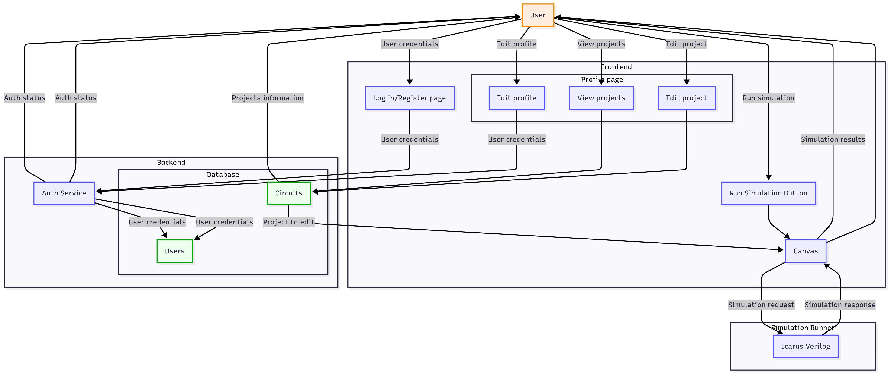
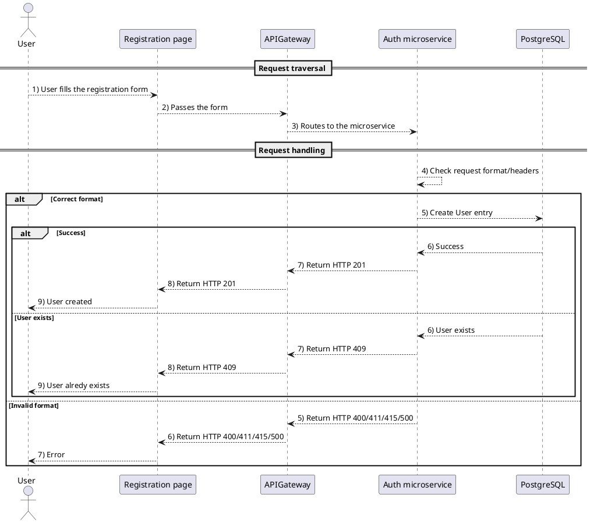
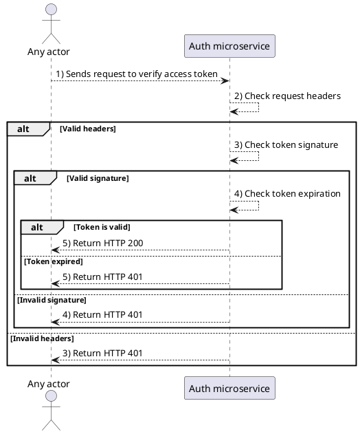

# Visual-Circuit-Designer
Visual-Circuit-Designer is web-based platform that could provide students and learners good experience in designing circuits similar to the Block Diagrams (like on Computer Architecture), but without the need to install Quartus Prime or huge Virtual box image. 


[Link to our product](https://www.visual-circuit-designer.ru/)

[DEMO]()


## <div align="center">Usage</div>

### <div align="center">Project goal</div>

The goal of our project is to create web-based platform for designing, simulating, and managing digital logic circuits with an intuitive interface.

### <div align="center">Project Context Diagram</div>



#### Key Components 
1. User(student/engineers who will use out product)
2. Database(to store projects and users information)
3. Frontend(User Interface with which the user interacts)
4. Backend(this part user can not see, bur it exists)
5. Runner node(to run simulation)

### <div align="center">Feature Roadmap</div>

- [x] Add drag and drop to place circuits on grid
- [x] Add simulation with ability to change inputs in real time
- [x] Add ability to locally store projects
- [x] Add ability to upload projects from users device
- [ ] Add ability to store projects in the cloud storage
- [ ] Add ability to share projects among users community
- [x] Add multiple tabs to work on several projects at the same time
- [x] Add multiple themes of UI to make it more comfortable
- [ ] Add reusable custom blocks to simplify complex designs

### <div align="center">Usage Instructions</div>

Follow these steps to launch and explore the MVP v2:

1. **Open the Application**  
  - Navigate to [Visual Circuit Designer](https://www.visual-circuit-designer.ru)

2. **Access**  
  - The service is **completely free** and **open**.  
  - **No registration** or user account is required.

3. **Core Functionality**  
  - **Create & Edit** logical circuits using basic components.  
  - **Configure** various global settings via the **Settings** menu.

4. **Exploration & Testing**  
- Once the page loads, you’ll land directly in the workspace.  
- Use the **Menu** to drag-and-drop components onto the canvas.
- Switch between tools and pick different wire styles (bezier, step and straight) directly from the toolbar to control how connections are drawn.
- Open the **Settings** panel to fine-tune circuit and application options.

### <div align="center">Project Installation</div>

For those who want locally launch our project

1. **Clone the repository**

      In terminal run 
    ```bash
    git clone https://github.com/IUMusicalFish19/Visual-Circuit-Designer
    ```
2. **Navigate to project**

      In terminal run
    ```bash
    cd path/to/project
    ```
3. **Make sure you have all needed dependencies**

      In terminal run
    ```bash
    cd path/to/project
    ```


## Architecture
### Overview
The system follows a microservice architecture with an API Gateway as the central entry point, serving as a reverse proxy to route requests to appropriate backend services. The architecture includes four main microservices, a frontend component, and supporting data stores.
### Static view

#### Key components
1) **API Gateway**
    - Acts as the single entry point for all client requests
    - Routes requests to appropriate microservices based on path:
        - `/api/runner` -> Runner Node
        - `/api/profile` -> Profile microservice
        - `/api/auth` -> Auth microservice
        - `/api/library` -> Library microservice
        - Serves static frontend files from the File System
2) **Microservices**
    - **Auth microservice**
        - Manages user authentication and authorization
        - Handles token blacklisting and verification
        - Stores user credentials and authentication data
    - **Profile microservice**
        - Manages user profiles and projects
        - May require token verification for access
    - **Library microservice**
        - Manages public library
        - May require token verification for access
    - **Runner Node**
        - Executes simulators for user projects
3) **Frontend**
    - Staticly built frontend application served directly by the API Gateway
    - Interacts with backend services through the API Gateway
4) **Data stores**
    - **PostgreSQL**:
        - Primary relation database storing:
            - User data
            - Projects data
            - Library content
    - **Redis**
        - Used by Auth service for token blacklist management
        - Provides fast access to temporary authenication data
#### Communication Patterns
- All client requests first hit the API Gateway
- Microservices communicate with their dedicated database components
- Auth services provides centralized token verification used by other services
- Frontend is served as static files with API calls routed through the gateway

### Dynamic view
#### Auth microservice
The **Auth microservice** is responsible for **authentication**, **authorization**, and **token management** in the system.
- **User Registration Flow**\
    **Endpoint:** `/api/auth/register`\
    **Purpose:** Create a new user account.

    
- **User Login Flow**\
    **Endpoint:** `/api/auth/login`\
    **Purpose:** Authenticate user and issue access & refresh tokens.

    
- **Token Verification Flow**\
    **Endpoint:** `/api/auth/verify`\
    **Purpose:** Validate and access token (used by other services).

    
- **Token Refresh Flow**\
    **Endpoint:** `/api/auth/refresh`\
    **Purpose:** Renew expired access tokens using a refresh token.

    

### Deployment view
The system is deployed using **Coolify** for container orchestration, with **Nginx** serving as the API Gateway and reverse proxy.

#### Key aspects
- **Hosting**:
    - Domain: `visual-circuit-designer.ru` (HTTPS via Coolify's reverse proxy)
    - Static frontend files and `nginx.conf` are stored in **Coolify-managed storage**.
- **Microservices**
    - **Auth**, **Profile**, **Library**, and **Runner** run as **Docker containers** in an isolated network.
    - Services communicate via **internal HTTP** (routed by Nginx).
- **Data Stores**
    - **PostgreSQL** (primary database for users, projects, and library data)
    - **Redis** (used by **Auth** for token blacklisting)

This architecture ensures **secure, scalable, and maintainable** deployment with clear separation of concerns.
## Development
### Kanban board
https://github.com/orgs/IUMusicalFish19/projects/1/views/6

Columns: 
- Sprint
  - Difficulty assessed (story points)
  - Acceptance criteria are specified
  - Addition to the column approved by the customer
  - Someone on the team plans to do this during the sprint
- In progress
  - Someone signed up for this task and started working on it
- Done
  - Task is done(acceptance criteria done)
  - Execution approved by team members
- Paused/Research required
  - A team member started working on this task but was unable to complete it.

### Git workflow
For our project we used GitHub flow.

Rules: 

- For creating issues from the defined templates:
<ol style="list-style-type: decimal;">
<li> Create an issue and immediately set acceptance criteria for it</li>
</ol>  

- For labeling issues:
  
  Currently we have 7 labels. Tasks can be labeled based on these rules:
<ol style="list-style-type: decimal;">
  <li><b>frontend</b> - Should be used for an issue that involves changing the user interface.</li>
  <li><b>backend</b> - Should be used for an issue that is related to a part of the project that is not visible to the user.</li>
  <li><b>bug</b> - Should be used for an issue that arose after an error was noticed in the project's operation.</li>
  <li><b>enhancement</b> - Should be used for an issue that somehow improves the work of the project, but without which the project works.</li>
  <li><b>task</b> - Should be used for an backlog task.</li>
  <li><b>triage</b> - Should be used for some task that is not sorted yet.</li>
  <li><b>user story</b> - Should be used for issue that formulated in user-story-format.</li>
</ol>
  
- For assigning issues to team members:
  
<ol style="list-style-type: decimal;"> 
  <li>Each team member selects tasks from the sprint that they want to complete.</li>
  <li>If any tasks from the sprint remain without an assigned teammate, this task goes to the one who has fewer user points for his tasks.</li>
</ol>
  
- For сreating, naming, merging branches:
  
<ol style="list-style-type: decimal;"> 
   <li><b>Creating: </b> For all issues should be created separate branch.</li>
  <li><b>Naming: </b> Name of branch should briefly explain the purpose of creating this branch.</li>
  <li><b>Merging: </b> To merge branch with "dev" branch teammate must create pull request.</li>
</ol>
  
- For commit messages format:
  
  A commit should explain what changes were made to the project.
- For creating a pull request for an issue using a pull request template:

- For code reviews:

- For merging pull requests:

- For resolving issues:

### Secrets managment
We have no password or API keys for now, so we have no secrets
## Quality assurance
### Quality attribute scenarios
Link to the “docs/quality-assurance/quality-attribute-scenarios.md” file:
https://github.com/IUMusicalFish19/Visual-Circuit-Designer/blob/readme/docs/quality-assurance/quality-attribute-scenarios.md

### Automated tests


## Build and deployment
